# VibeKids

<p align="center">
  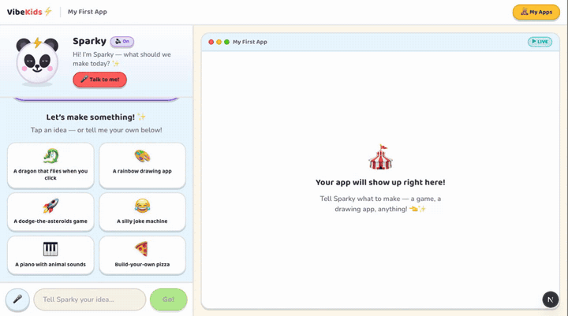
  <br>
  <sub><b>A real build, recorded on the author's local dev setup (2026-10-05).</b> One Dream-It-Up answer ("a game where a frog catches falling stars"), then 🚀 build. Claude wrote Sparky's lines and the whole game (AI-generated, unedited) in 62 s; that wait is shown at 8× speed. Then the frog is played for a few seconds. Playwright drove the clicks; it ran the original pre-export code on the author's own Claude subscription, before this public copy switched the default to an API key.</sub>
</p>

**Not safe for real children: no auth, no parental consent (COPPA), no output moderation.** This is a local proof of concept; see [Status and limitations](#status-and-limitations).

**VibeKids is a coding agent for children.** A kid aged about 8 to 12 types an idea, taps one, or says it out loud. Sparky, a friendly panda, builds it with Claude, and the working app shows up in a sandboxed live preview beside the chat. Tools like Lovable, Replit, Bolt and v0 already do "say it and it's built" for adults, but none of them is designed for children. VibeKids keeps that loop and adds what kids need: a 2nd-to-4th-grade reading level, read-aloud and push-to-talk, tappable choices that fill the wait while the build runs, a pre-build interview for kids who don't know what to ask for, and a safety model built into the architecture rather than added afterwards. The stack is Next.js 16, Convex (realtime) and the Claude Agent SDK, with a tool surface of seven sandboxed tools. It is a **v0, local-only proof of concept**, not a product.


## Demo

<p align="center">
  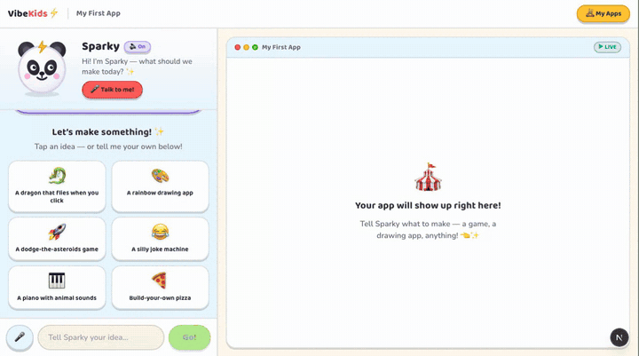
  <br>
  <sub>The real UI running locally (2026-10-05): the empty canvas → tapping <i>Dream it up</i> (Sparky's opener and first question are deterministic, with no model call) → the <b>My Apps</b> shelf → Star Counter, an app Sparky generated earlier, played in the sandboxed preview. Playwright drives it against a local, account-free Convex backend with seeded demo data.</sub>
</p>

| | |
|---|---|
| 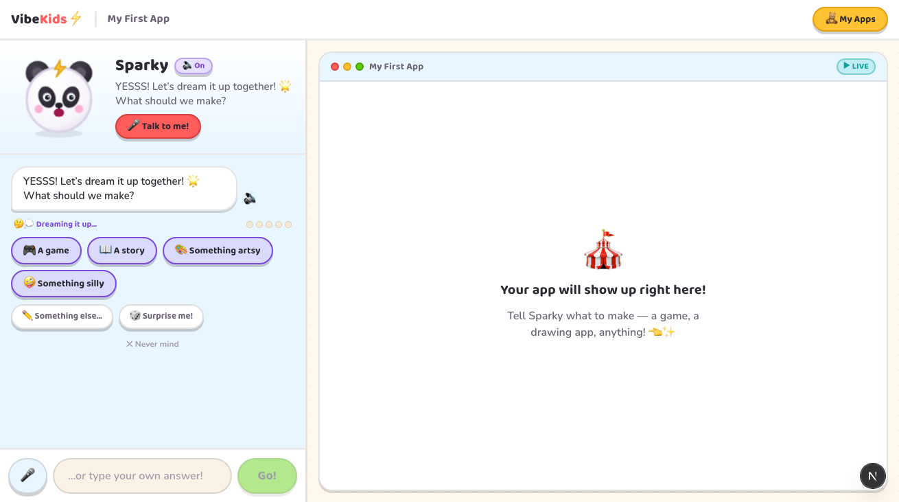 | 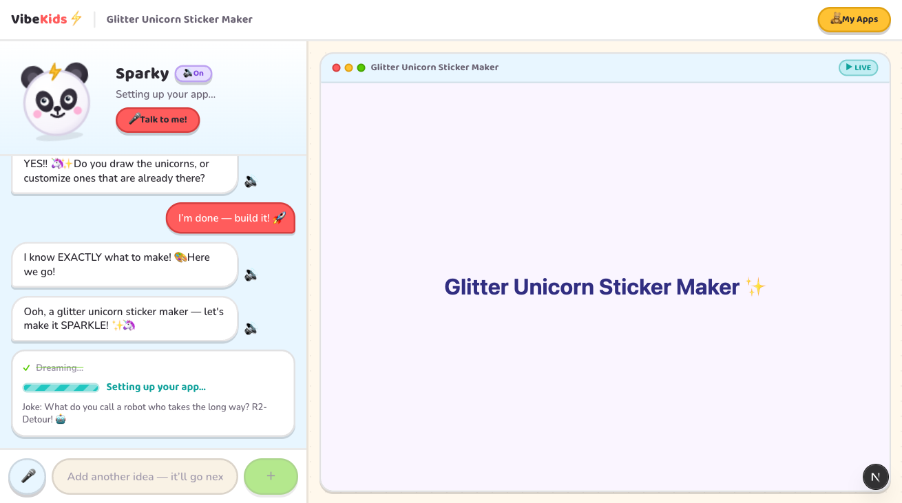 |
| **Dream-It-Up, for a kid who doesn't know what to ask for.** Sparky asks up to five quick questions. Each has 3–4 tappable answers, plus ✏️ type-your-own, 🎲 surprise me and ✕ never mind. Five dots show the question budget. | **Then it builds.** 🚀 *"I'm done — build it!"* skips the rest. The answers are compiled into a brief for one build turn, and Sparky reacts the moment the kid taps. |
| 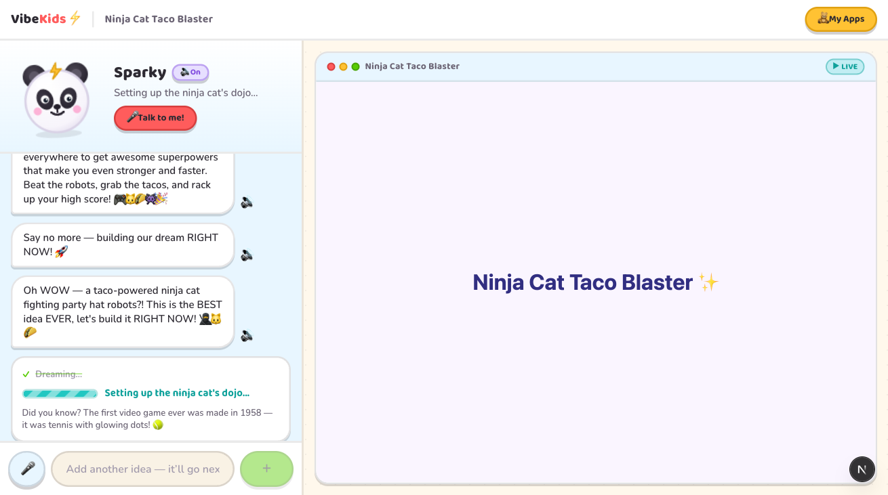 | 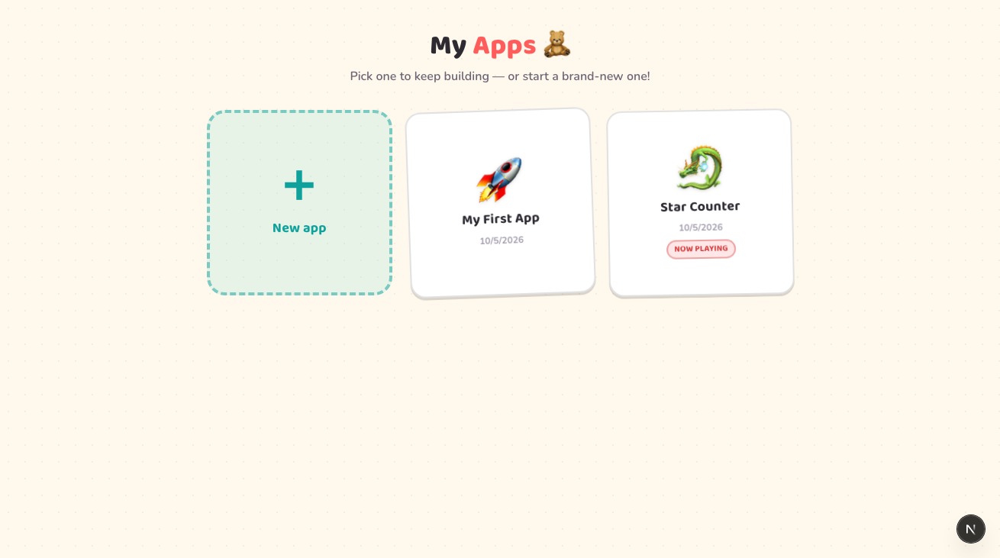 |
| **The wait is part of the show.** A kid-worded step trail driven by machine state (`buildStatus.state`), a striped progress bar and rotating fun facts. Sparky's first line is written by the route, not the model, so it appears immediately. | **My Apps shelf.** Each project is one app. A kid can switch between apps or start a new one. |

<p align="center">
  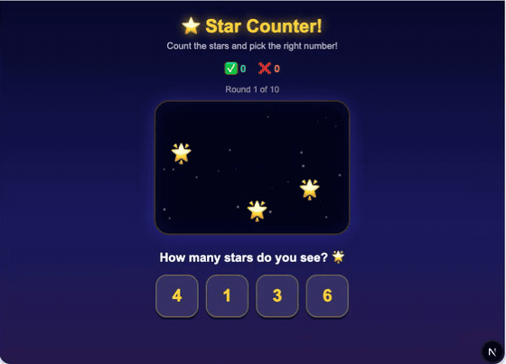
  <br>
  <sub><b>Star Counter</b> is a counting game Sparky generated during development (the HTML is AI-generated and unedited). It is replayed here in the sandboxed <code>&lt;iframe srcdoc&gt;</code> preview. The clicks are scripted with Playwright, with one wrong answer on purpose to show the "Almost!" feedback. Recorded 2026-10-05 against a local, account-free Convex backend, with no model calls.</sub>
</p>

| | |
|---|---|
| 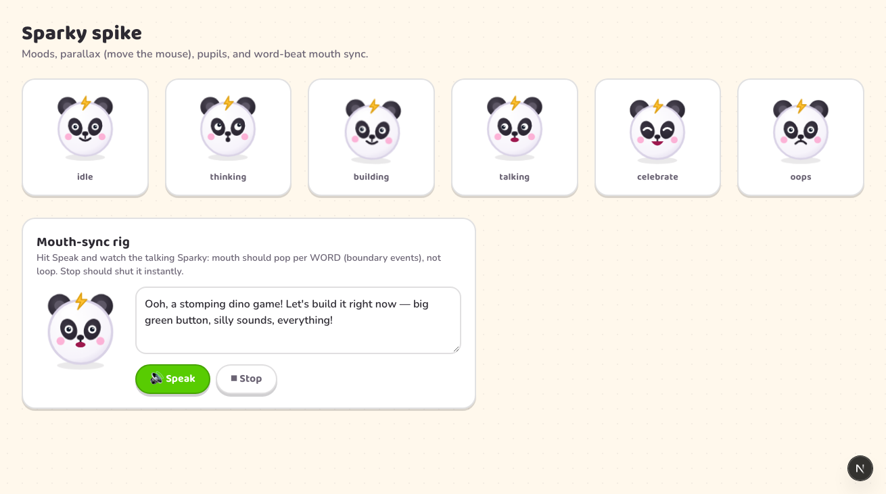 | 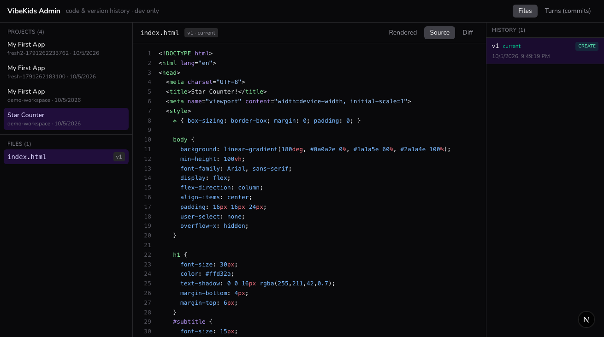 |
| **Sparky** is CSS/SVG with six moods (idle, thinking, building, talking, celebrate, oops), mouse parallax and a mouth synced to each word. This is the `/spike-sparky` page. | **`/admin`** is a dev-only time machine. It shows every write as an immutable, turn-stamped version, Shiki-highlighted source, a side-by-side diff, and a non-destructive whole-turn restore. |

The hero GIF is a live build on the author's local setup (2026-10-05). The build-now and build-in-progress stills came from development runs with a live model on 2026-07-08. The rest were captured on 2026-10-05 with Playwright on a fresh local backend. That data was seeded with `projects:create` / `files:write` and holds the Star Counter HTML above plus empty projects. No child data is involved anywhere.

## Architecture

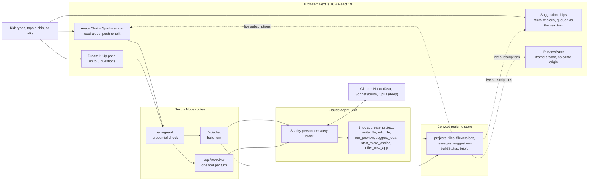

The agent can't touch a filesystem, a shell or the network. The built-in tools are switched off (`tools: []`), and each of the seven custom tools is a project-scoped Convex write. The preview re-renders from the `files` table through a live subscription, so the app shows up while it is being written and nobody has to refresh. The preview iframe gets `sandbox="allow-scripts allow-modals"` *without* `allow-same-origin`, so generated code runs in an opaque origin with no access to cookies or the parent page.

### One build turn

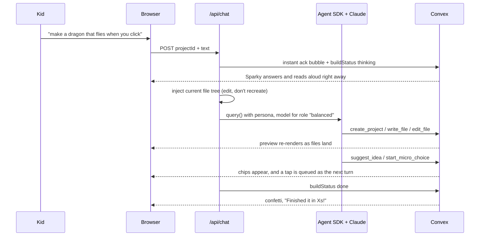

Two design choices drive this flow, and the decision log records both:

- **Latency is a feature.** The SDK can take about 70 s to write the first file of a complex build. So everything a kid needs right away (the ack, read-aloud, the status) is written by the route the moment they act. The wait is filled with choices that feed the *next* turn and are never injected mid-run (ADR 0005).
- **The UI follows machine state, never Sparky's wording.** Lifecycle (`thinking | building | done | error`) is a field, not a regex over kid-facing text. A runtime error inside the preview is posted out of the iframe and turned into a "Ask Sparky to fix it" turn instead of a stack trace.

## Measurements

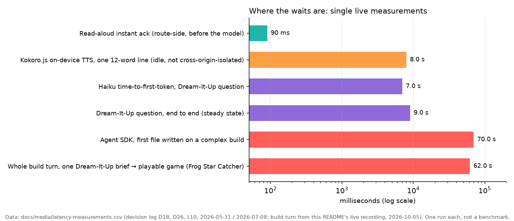

<sub>Data: [`docs/media/latency-measurements.csv`](docs/media/latency-measurements.csv), taken from the decision log entries D18, D26 and L10 (2026-05-31 and 2026-07-08), plus the whole build turn from the live recording at the top (2026-10-05). Each is a single live measurement on one Mac in local dev, not a benchmark.</sub>

These numbers shaped the design. On-device Kokoro.js TTS sounded warmer but took about 8 s per line, because the page isn't cross-origin-isolated and the WASM ran single-threaded. It was reverted to Web Speech (D18, L11). The interview's model turns cost about 9 s each, so the opener, "change something" and "build now" are deterministic and need no model call (D26).

What was checked for this export (2026-10-05, Node 22.23):

| Check | Result |
|---|---|
| `npm test` (vitest) | 45 tests in 6 files pass: pure modules for preview compose and reconstruct, interview compile, continuity, build mood, provider |
| `npx tsc --noEmit` | clean |
| `npx eslint` | 6 errors and 9 warnings remain (not fixed for the export) |
| App against a local anonymous Convex backend | home, shelf, `/admin` and `/spike-sparky` render; preview runs a generated app |

## Repo tour

| Path | What |
|---|---|
| `app/api/chat/route.ts` | The build turn: guard, continuity (inject the current files), Agent SDK `query()` loop, status |
| `app/api/interview/route.ts` | Dream-It-Up: deterministic beats plus one Haiku tool call per question |
| `lib/ai/tools.ts`, `lib/ai/interview-tools.ts` | The tools (zod-validated, all writes go to Convex) |
| `lib/ai/persona.ts` | Sparky's system prompts and the single centralized safety block |
| `lib/ai/provider.ts` | `modelForRole()`, the only place model ids live, plus the `LLM_PROVIDER` switch |
| `lib/preview/compose.ts` | Builds the multi-file project into one `srcdoc` and injects the error catcher |
| `convex/fileVersions.ts` | Append-only version history, turn grouping, non-destructive rollback |
| `components/` | SplitScreen, AvatarChat, SparkyAvatar, BuildShow, Celebration, Shelf, admin console |
| `app/spike-*` | Isolated spikes: Sparky avatar, Rive, Kokoro TTS |
| `docs/adr/` | 10 architecture decision records |
| `docs/decisions/LOG.md` | Decisions D1–D26 and hard-won learnings L1–L14 |
| `docs/research/` | Design research behind the features (wait-time engagement, interview patterns, versioning, PII redaction, …) |
| `CLAUDE.md`, `AGENTS.md`, `.claude/` | The agent-driven workflow the project was built with: rules, skills, kickoff/retro commands |

## Requirements

- macOS, Linux or Windows with **Node.js 22**. Nothing here is Apple-specific, and there is no local ML. (The Kokoro spike page downloads a TTS model into the browser, but only when you open it.)
- A Chromium-based browser for read-aloud and push-to-talk (the Web Speech API). Note that Chrome's speech recognition sends audio to a cloud service.
- **Convex**: either a free Convex account, or the account-free local backend (`CONVEX_AGENT_MODE=anonymous`, which downloads Convex's local backend binary).
- **Claude access for the agent.** By default (`LLM_PROVIDER=api`) the Agent SDK uses an `ANTHROPIC_API_KEY` (pay-per-token); Bedrock and Vertex also work through the SDK's own environment variables. `LLM_PROVIDER=subscription` is a clearly labelled opt-in for **personal local experiments only**, using your own `CLAUDE_CODE_OAUTH_TOKEN`; never use it for anything other people use. See Anthropic's [Agent SDK docs](https://code.claude.com/docs/en/agent-sdk/overview) on authentication.

## Run it locally

```bash
npm install
cp .env.example .env.local        # add your ANTHROPIC_API_KEY

# terminal 1: the backend (pick one)
npx convex dev                                  # Convex account (interactive first run)
CONVEX_AGENT_MODE=anonymous npx convex dev      # no account: local backend on 127.0.0.1:3210

# terminal 2: the app
npm run dev                                     # http://localhost:3000
```

- `http://localhost:3000` opens the kid app. A new browser gets an anonymous workspace containing "My First App".
- `http://localhost:3000/admin` is the dev-only code and version-history console. It returns a 404 in production builds.
- `npm test` runs the unit tests. `npm run smoke-test` makes one small Agent SDK call with a custom tool to check your credential works (a few hundred tokens).
- Without a Claude credential the UI, shelf, admin and spikes all work, and the chat routes return an error (`ANTHROPIC_API_KEY not set`) before any model call.

## Status and limitations

Honest status as of the last development work (2026-07-08):

- **Working and verified live in local dev:** chat → build → live preview; edit-don't-recreate continuity; suggestion chips and micro-choices; Dream-It-Up interview; read-aloud and push-to-talk; animated Sparky; build show and confetti; runtime-error auto-heal; multi-app shelf; version history with turn-level restore in `/admin`.
- **Not built:** Sandpack / React preview (Tier B, so only HTML/CSS/JS apps run), the "Making-It Card", the Haiku output-moderation pass, persona polish, any deploy path.
- **Not safe for real children yet, by design.** There is no auth, and the workspace is an anonymous id in `localStorage`. There is no parental consent (COPPA), no moderation of model output beyond the persona's safety block and the sandbox, and voice uses browser speech services. The roadmap puts adult-only logins with kids as profiles, verifiable parental consent (including for voice), and dual-layer moderation *before* any kid outside development uses it ([ADR 0004](docs/adr/0004-no-auth-anon-workspace-v0.md), [ADR 0006](docs/adr/0006-voice-in-v0-read-aloud-and-push-to-talk.md)).
- Issue numbers (#NN) in the docs point to the project's original private tracker, which was not exported.
- Sparky's chat bubbles show the model's markdown as raw text (`**bold**`); a markdown renderer is not wired in yet.
- Lint isn't clean (see above). The Kokoro spike numbers in older notes were corrected after an honest re-measurement (LOG D18, L11).

The full plan is in [ROADMAP.md](ROADMAP.md). For why things are the way they are, see [docs/decisions/LOG.md](docs/decisions/LOG.md) and [docs/adr/](docs/adr/).

## Credits and licences

- Code: [MIT](LICENSE).
- AI-generated content: Sparky's chat text and the generated apps in the screenshots and GIF (Frog Star Catcher, Glitter Unicorn Sticker Maker, Star Counter) were produced by Anthropic's Claude models through the Claude Agent SDK.
- Fonts: [Baloo 2](https://fonts.google.com/specimen/Baloo+2) and [Nunito](https://fonts.google.com/specimen/Nunito), both SIL Open Font License, self-hosted at build time through `next/font`.
- Main dependencies: [Next.js](https://nextjs.org) (MIT), [React](https://react.dev) (MIT), [Convex](https://www.convex.dev) client (Apache-2.0), [Claude Agent SDK](https://www.npmjs.com/package/@anthropic-ai/claude-agent-sdk) (subject to Anthropic's terms), [Tailwind CSS](https://tailwindcss.com) (MIT), [Shiki](https://shiki.style) (MIT), [jsdiff](https://github.com/kpdecker/jsdiff) (BSD-3-Clause), [zod](https://zod.dev) (MIT), [Rive React runtime](https://github.com/rive-app/rive-react) (MIT), [kokoro-js](https://www.npmjs.com/package/kokoro-js) (Apache-2.0).
- `/spike-rive` loads a public sample animation from Rive's own CDN at runtime, and `/spike-kokoro` downloads the Kokoro-82M model (Apache-2.0) at runtime. Neither asset is included in this repo.
- `docs/agents/domain.md`, `issue-tracker.md` and `triage-labels.md` are adapted from [mattpocock/skills](https://github.com/mattpocock/skills) (MIT, Copyright (c) 2026 Matt Pocock); the licence text is in [`docs/agents/LICENSE-mattpocock-skills.txt`](docs/agents/LICENSE-mattpocock-skills.txt).
- Sounds are synthesized with WebAudio, and emoji are rendered by the system font. The repo contains no third-party media.
